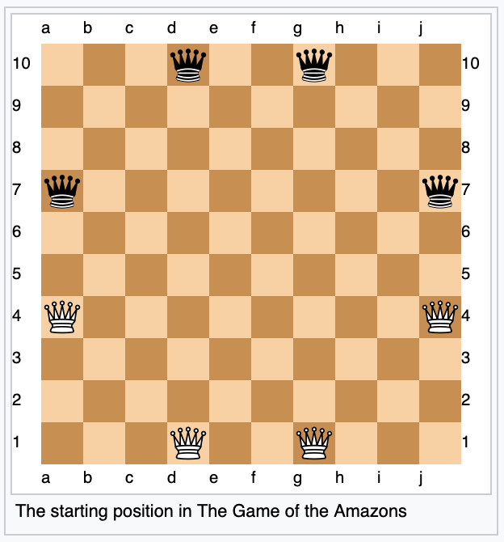
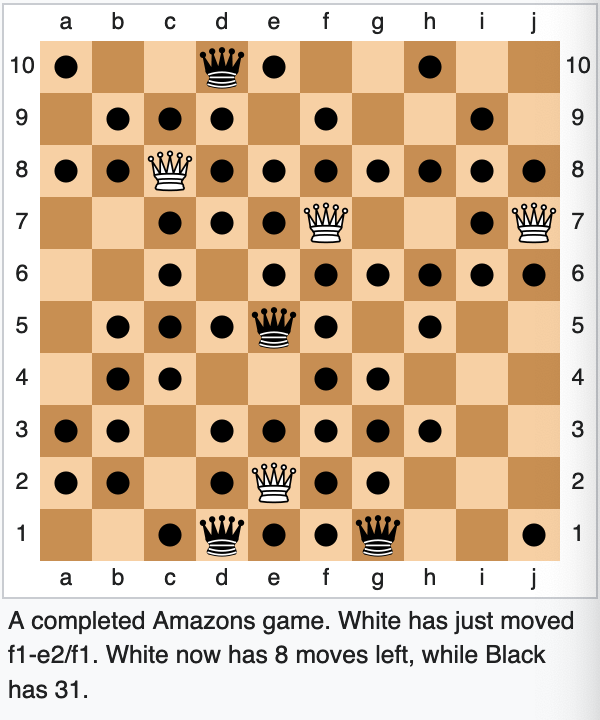

# Guidelines and Evaluation
The project is worth 30% of the overall grade. All components of the project are worth a certain percent of the project mark:
- [X] Team Organization: 5%
- [X] Warm-up Demos: 10%
- [X] UML Diagram
- [X] Check for Client-Server Commmunication
- [X] Ability to start the game as both Black/White
- [X] Progress Report: 15%
- [X] Demo (via tournament participation): 35%
- [X] Report and Implementation (techniques implemented and software-engineering aspects): 35%

# Goal
To implement a Java-based Game Player with a graphical user interface that can play with the Game Players developed by other teams. All the teams are required to implement a game client for the Game of the Amazons.

# Game of the Amazons

- Two-player abstract strategy game.
- Played on a 10x10 chess board (or an international checker board).
- The two players are White and Black; Each player has four amazons which start on the board in the configuration shows above.

## Rules
- White moves first, and the players alternate moves thereafter.
- Each move consists of two parts:
    - First, move your own amazons one or more empty squares in a straight line (orthogonally or diagonally), exactly as a queen moves in chess.
        - It may not cross or enter a square occupied by an amazon of either color or an arrow.
    - Second, after moving, the amazon shoots an arrow from its landing square to another square, using another queen like move.
        - This arrow may travel in any orthogonal or diagonal direction (even backwards along the same path the amazon just traveled, into or across the starting square if desired).
        - An arrow, like an amazon, cannot cross or enter a square where another arrow has landed or an amazon of either color stands.
        - The square where the arrow lands is marked to show that it can no longer be used.
- The last player to be able to make a move wins.
- Draws are impossible.

## Territory and Scoring
- The strategy of the game is based on using arrows (as well as one’s four amazons) to block the movement of the opponent’s amazons and gradually wall off territory, trying to trap the opponents in smaller regions and gain larger areas for oneself.
- Each move reduces the available playing area, and eventually each amazon, finds itself in a territory blocked off from all other amazons. The amazon can then move about its territory firing arrows until it no longer has any room to move.
- The player with the largest amount of territory will be able to win, as the opponent will have to fill in her own territory more quickly.

- When scoring, it is important to note that although the number of moves remaining to a player is usually equal to the number of empty squares in the territories occupied by that player’s amazons, it is nonetheless possible to have defective territories in which there are fewer moves left than there are empty squares.
    - The simplest such territory is three squares of the same color, not in a straight line, with the amazon in the middle (for example, a1+b2+c1 with the amazon at b2).
